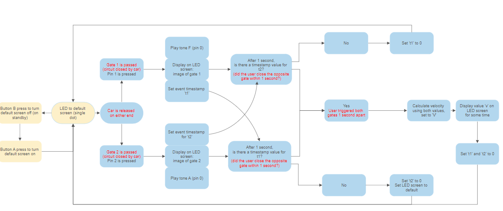
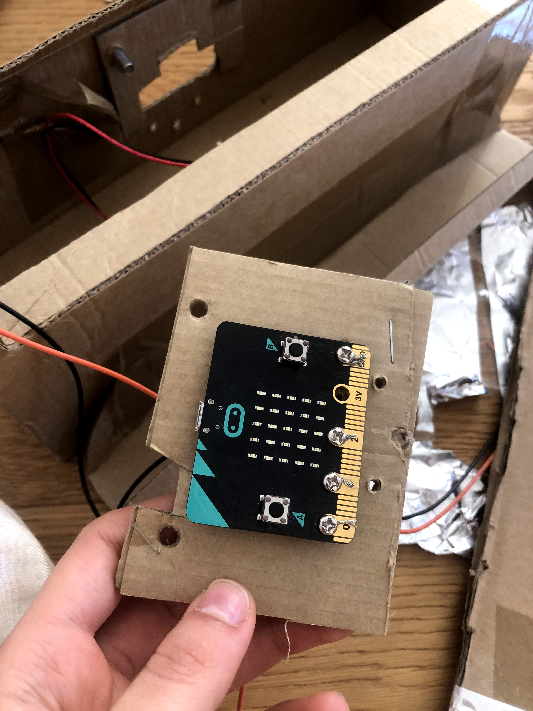
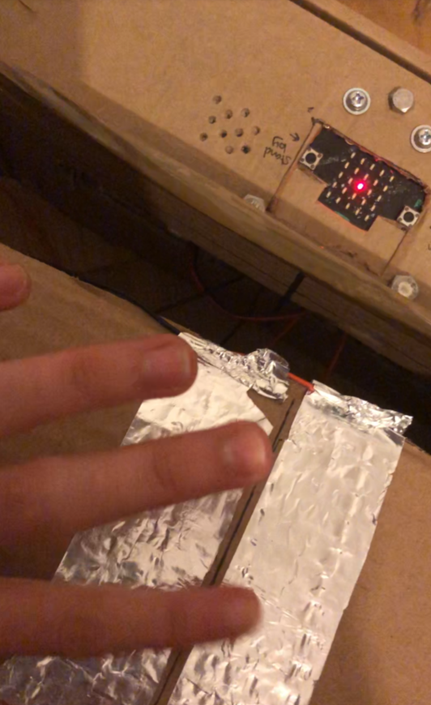

# Assessment 1: Replication project

## Timing Gates ## 
I chose this project because creating and calculating values from timestamps is relevant to my idea for Assessment
https://makecode.microbit.org/projects/timing-gates

### Final materials: ###
Microbit

Wire

Speaker

Aluminium foil

Tape

Carboard

Toy Car

Screws, Nuts and Bolts (assorted)

A $2 coin

PVA glue 

## Related projects ##
It was difficult to find information online relevant to my project in some ways because it is the hard way of doing something quite basic. Using this particular kind of 'sensor' where an object closes a circuit without the use of any other sensors seems unconventional. The tracking of movement appears to be mostly done with infra-red sensors, but could also be done with a pressure sensor, a light sensor, an ultrasonic distance sensor, and others I'm sure. 

### Related project 1 ###
[Kitronik Case](https://www.kitronik.co.uk/c5611-mipower-case-for-the-bbc-microbit.html)

I wasn't sure how to most neatly incorporate the microbit into my project with the LED screen and the buttons accessible. Not a lot of people were making neat microbit projects. If they wanted a professional look they would hide a mini Arduino. I drew on the design of this case to securely fit in my microbit while only showing the buttons and the LED screen. 

### Related project 2 ###
[DIY pressure plate](https://www.youtube.com/watch?v=c6RXu0pYUVI)

This project essentially demonstrates how my plates are supposed to work but at a larger scale. Although I did not get the idea from this video but rather as advice from a professional, it still demonstrates the concept (and also demonstrates that it can't be scaled down very well). 

### Related project 3 ###
[Other iteration of timing gates](https://github.com/microsoft/pxt-microbit/issues/1996)

This project supported me on the claim that the guide is wrong and that the microbit uses microseconds rather than milliseconds or seconds. 

### Related project 4 & 5###
These projects demonstrate my claim that IR sensors are the preferred way to detect moving objects like toy cars, and that no one investigates my method to detect passing objects. 

https://www.electronicshub.org/street-lights-that-glow-on-detecting-vehicle-movement/

https://create.arduino.cc/projecthub/unexpectedmaker/arduino-hot-wheels-speed-track-part-1-prototype-6a01b8

## Reading reflections ##

### Reading: Don Norman, The Design of Everyday Things, Chapter 1 (The Psychopathology of Everyday Things) ###

*What I thought before:* I'd previously felt that those sinks with the push down drain button were quite intuitive but I realise this is a learned behaviour. I've had experience with those sinks since I was a child, and the reading made the case that it really wasn't good design at all. It really is counterintuitive to dirty your hands to empty a sink. This must show how important it is to see past your own preconceptions about what is and isn't obvious. 

*What I learned:* This text was very informative. As with all things design I guess everyone has some intuitive knowledge of these things, but giving them terms like affordance and signifier and feedback demonstrates how things are made the way they are deliberately even when we don't feel it. I'd never considered that affordances and signifiers can disagree. This seems very important. A device that doesn't work in the way the user really thinks it would is so frustrating. I was aware that light switch arrangement should spatially match the lights in the room, but I'd also never considered that mapping and conceptualisation is a means of coping with the abstraction of electronics. Or that the design of an object can actively steer you away from some action (anti-affordance). 

*What I would like to know more about:* It would be interesting to know how certain accepted conceptualisations came about. Some, as the text acknowledges, are natural. But others weren't intuitive at some point and now are, especially the conventions of webdesign and OS's and such. 

*How this relates to the project I am working on:* The basic design principles outlined in this reading are integral to any project. I need to keep in mind what affordances my project has, and which ones it suggests with signifiers; what do I want people to do and what will people inevitably try to do, how I will feedback when they're doing it right and wrong. 

### Reading: Chapter 1 of Dan Saffer, Microinteractions: Designing with Details, Chapter 1 ###

*What I thought before:* Many of the things I would've called features are called microinteractions here, like converting currencies or units of measurement. For things that I accepted as microinteractions, I didn't recognise their importance, "your product is as good as the smallest part" is the claim made by the text. I'm not sure I entirely agree in every case but I like the sentiment. I don't think a silent switch that gives poor feedback ruins the iPhone, but I guess the minimalism echoes through the whole product and causes the same problems at times. But a video player with an unreliable volume control I'm going to steer away from. I think the text understands that the impact of any one microinteraction is less and less the more features there are. 

*What I learned:* I never considered that microinteractions are the "feel" of the product and it makes total sense. When I think about the products I most love among many (competitive market) it really is the details. Many microinteractions I understand now I take for granted, like scrolling pixel by pixel down my screen. 
This reading also touches on the disconnect between electronics and what we use to control them, and that interfaces are a method to cope with this disconnect.
I never knew the rule behind apples silent switch, although I ran into the same assumption as in the last reading. Because I grew up with something it feels intuitive and I need to see past my own preconceptions. The accessibility of the silent switch never occurred to me. Being one of 5 physical inputs, it's really as accessible as it can be.  

*What I would like to know more about:* I was interesting to learn that microinteractions can be signatures of a product. I'm interested to find more examples of this. I imagine it is a difficult balance preserving signatures and implementing the best microinteraction for the job. 

*How this relates to the project I am working on:* The replication project will necessarily have microinteractions. The text recommends you identify all possible microinteractions in you product and refine them all to the best of your ability. I am now more aware of the details and how they come to represent the whole. I'll be keeping this in mind when it comes to finalising the project. 

### Reading: Scott Sullivan, Prototyping Interactive Objects ###

*What I thought before:* I somewhat denied that people come to expect technological (phones, web) functionality from their physical world. I viewed my devices as a dedicated space for "knowledge and control" and the greater world as a separate thing, but the text argues otherwise and I don't see why this wouldn't be true, even for me. 

*What I learned:* The reading demonstrated to me how someone with limited experience of programming and electronics could patchwork together a working prototype of quite an intelligent tool from example code and other publicly available tools. 
The text reminded me how, as with anything but especially making a product from scratch, there are always unforeseen technical issues, ie: fluctuating light levels setting off camera. The author tried many different methods after finding they weren't working. It's important not to cling onto methods and explore others, but also revisiting earlier methods. The author returned to the first sensor he worked with. The issues can sometimes be non-technical, such as the rather funny but definitely an issue of bomb anxiety surrounding these devices under tables, or cameras used non-invasively still have the potential and therefore the suspicion from customers. 

*What I would like to know more about:* I'd like to find a good repository of example code that would've assisted me on this project. But perhaps my issues were too niche.  

*How this relates to the project I am working on:* This text is motivating a person like me who has little programming and electronics experience to persevere, because, paraphrasing, "it feels like a punch in the face, but a punch in the face you realise isn't so bad and now you're not afraid of it". I always enjoy reading the logs behind someone's work. I should keep structure in mind when inserting my log. 

## Interaction flowchart ##

# Process documentation #
## Step 1: Testing that the gates can close using a basic track with basic aluminium sensors ##

### Making connections ### 
I won’t be using alligator clips for this assignment. I’ll be using just wires instead. I did not need to connect two wires together in the end, although throughout replication processes I hooked two exposed ends together and taped them, as the tutor recommended. 
I tested out a couple of connections of wire to sensor. I found that wrapping the wire, threading it through the aluminium, sticking it on top and on the bottom of the aluminium all worked so for the rest of the prototyping I went with the easiest which was to tape the wire onto the sensor. I will need to change this for the final. 
I used the screws and nut provided to connect the other ends of the wires to the microbit. This appears to be a secure method, except that with excessive twisting the exposed wires in the hole tend to break off from the rest of the wire. This shouldn’t be an issue once the microbit is secured. 
The code I had at this point was minimal, just to tell me that the circuit is closed. I changed the image from the guide to match the orientation of my workspace. 

### Do the gates close using just my finger? -###
Yes. Connections do work. 
### Some issues: ###
The gap in between the two sensor strips needs to be small, and I reduced it in the later iteration. Otherwise the sensor isn’t sensitive enough. 
I found that the sensors weren’t reactive enough when tapped rapidly, so I spaced the gates apart in later iterations. 
The following more refined iteration of the track looked like this:

It uses copper conductive tape instead of aluminium. I also added some walls to stop the car from falling. Most of my car tests were conducted on this track. 
## Step 2: Cars ##
### Version 1 ###
In class I had a vision of a car with conductive thread suspended from its body that would always contact the ground somewhat closely. 

This did not work at all. Conductive thread isn’t conductive enough to close the circuit in a reasonable amount of time. Furthermore, it tended to get caught in the wheels.
### Version 2 ###
Scrapping the thread idea I iterated on the design of the car in the guide with a bit of aluminium sticking out from the bottom. I had to be careful that the aluminium didn’t get in the way of the wheels at all or didn’t drive straight.

Some of these designs conducted better than others. I thought maybe the aluminium wasn’t making close enough contact, so I attempted to improve contact by replacing the front wheels with a conductive patch. 

These designs conducted, but the circuit never closed at a reasonable speed. The car would have to stay on the plate for a second or more, and I certainly couldn’t let it roll on its own. Returning to the guide I read that “By moving the car (slowly) through the gate, you will see that it triggers the on pin pressed event.” In the demonstration the car moves very slowly and I thought I could do better. But it meant their version of the car was not designed to close the circuit quickly. 
### Version 2.5 ###
In a last attempt to keep the car, I suspended an aluminium plate with conductive thread from the body of the car. This was a terrible idea, and didn’t work at all.
### Version 3 ### 
I thought about the advice the tutor gave, “it might not have to be a car”. I thought about what other things could move on their own.
My solution needed to either:
1.	Have a slow moving object at the same level of conductivity so it had time to trigger the gates
2.	Improve the conductivity of the gates and move at the same speed. 

I attempted make a coin load connected to the car (located off the track), and hoped that gravity would keep close contact between the sensors and the load, and the load would slow down the car enough. This was not the case. The car was either not strong enough to pull the load, or it pulled it really well. Furthermore, the coin load (a coin wrapped in aluminium) barely conducted at all. I tried a gravity pulley with a coin load, but gravity is very fast! I found that bulldog clips are surprisingly conductive, but the results with them weren’t very different. 

I thought about using wind-up toys for the first solution. I considered using an ultrasonic distance sensor if I couldn’t think of a different solution. 
## Step 3: Track Improvement ##
### Additional LEDs ###
In the meantime, I wanted an indicator aside from the LED screen that signified that the gates had been triggered. Controlling the track situation and looking at the screen was difficult. I wanted to try LEDs placed next to the gates.

First issue I ran into was that I didn’t have enough pins. 0 and 1 were being used for the gates, leaving me with 2 for two separate LEDs. I know I could’ve used the edge connector but I wanted stronger connections. I made one LED run through pin 2 for gate 1, just to know that it’s responsive to the gate, and the other I connected to gate 2 circuit, hoping closing the circuit would power the LED. That did not turn the LED on, I assume because pins don’t have constant output. The other one worked though
I tried making it so that pin 1 output power when the gate was closed. 

That kept the pin on forever. Although in retrospect if I wrote Pin 1 to 0 power after the pause it might’ve worked. 
After that I tried making a connection with one of the edge pins without using an edge connector (just tape) to have an extra pin. It was a bad idea, lacked precision and didn’t work at all. 

For some time the one LED connected to pin 2 turned on anytime either gate was triggered, just to assist me, but I did not intent to leave it that way. 

### Buzzer ###
Regardless I scrapped the LEDs entirely. They had bigger latency than the LED screen, and still took attention away from looking at the track, even if less so. 
I used the buzzer instead, setting a different tone for each gate. Because of the buzzer (occupies pin 0)  I had to move the gates to pin 1 and pin 2. This is better than the LEDs even if they worked. It doesn’t occupy the eyes, although the lag is still there. 
## Step 2, resumed: Moving away from the car ##
I asked an aerospace engineer friend of mine how he would tackle the problem as I’d struggled to find any solutions online. This kind of sensor is an unpopular choice for any reliable projects. He suggested taping a sheet of aluminium above the two sensors (almost touching) and having the weight of the car be the trigger. This worked impressively!
I continued to iterate on this, creating a thin space between the aluminium and the copper with some tape. One to two pieces was enough to keep them separated. 

The car also needed to be made heavier. I taped a $2 coin on it. I wanted to put something dense and small in it, but found nothing fit in the cars body anyway and a $2 coin was the densest thing around. 
The sensor had the tendency to stick sometimes, but would easily be fixed with an additional tap. 
I thought I took a video of this but I guess I didn’t. I cannot demonstrate how well it worked anymore, but it really did. 
## Step 4: Outputting velocity ##
Now that all the pieces worked, I could move onto the maths. 
### The unit issue ###
I wanted the microbit to show the velocity of the car rather than the time it took to travel. I decided I would express the velocity as m/s, as this is the [SI](https://byjus.com/physics/unit-of-velocity/) unit of velocity (rather than cm/s). I also need to make the units clear on the final assembly. 
Without altering the units, I asked the microbit to do the following maths from Newton’s v = d/t:
T = t2 (timestamp 2) – t1 (timestamp 1)
V = 0.4/ √(T²)
I wanted the time to be calculated regardless of what order the gates were triggered in  (1 to 2, or 2 to 1). To do that I squared and found the square root of T to get the absolute value (when t2 is subtracted from t1 it is negative, but that doesn’t matter). Later I spotted ‘absolute ()’ in the list of commands and used that from then on. 

The numbers were ridiculously large. The [guide](https://makecode.microbit.org/projects/timing-gates) says the microbit shows seconds, but this is clearly not the case. Even in their demo their time displayed was in the thousands. I assumed the microbit would use milliseconds, since that’s the unit used in ‘pause’ and it keeps track of [running time](https://makecode.microbit.org/reference/input/running-time) (what is used as the timestamp) in milliseconds. But this was also not the case. 
Isolating just T, the number was in the millions. If this was milliseconds then it would be taking the car 10 minutes to cross the track. As an example, approx. two second apart the two gates were triggered. Their event time stamps were:
T1: 5817199
T2: 6942909
Difference= 1125710, would be 1125 seconds. That’s not right.
At this point I stopped using the physical track and just used the simulator to speed things up and have reliable trails to figure out the factor I needed to divide by if there was one. It occurred to me it might be in a different unit. 
I ran some trails with a 1000ms and 2000ms gap in between pressing buttons A and B. The microbit would display ‘T’ when 1/2s was up after pressing A so I knew to press B. Some delay is expected. If the difference T correlates with the gap, I can find the factor. If T is 1000, then it is in milliseconds, if it is 1 000 000, I’ll know to divide by a factor of 1000 to get milliseconds. 

Here I realised the units were microseconds. This is supported by this [forum thread](https://github.com/microsoft/pxt-microbit/issues/1996) that I had previously read but misread the first time. 
Now I know to divide by 1,000,000 to get seconds. 
### When will the microbit know to do the maths? ###
In the original project, the microbit would display the time anytime gate 2 was triggered. Because you can trigger either gate in my timing gates, it cannot be done this way. 
My first idea was successful. The microbit would create time stamp for the first gate, then check if the second gate has a timestamp (above 0) within a window of time. Originally the window was 500ms, later increased to 1000ms. If it had, then it display the V of these values. If it hadn’t, it would clear the timestamp (set to 0) and return to the default screen. 
I also found that I needed to clear the timestamps after V was displayed or else the gates kept their previous times, and if one gate was triggered on following trials a very wrong V would immediately display. 
I cannot round with the default ‘round’ function. It rounds to the whole number and V is a fraction so it rounds to 0.  Searching forums, I found someone use truncate. It does the same thing. I used the method of another user on a [forum post]( https://stackoverflow.com/questions/57230963/how-do-i-round-to-1-decimal-on-the-bbcmicrobit-with-javascript-w-o-tofixed-t), also with no luck (still many decimal points). 
### Final Code Touches ###
I tweaked the LEDs to match the new orientation of the microbit to the track
The B button now turns off the screen to conserve power but turns on automatically with gate triggers (on standby). If users want to check if the microbit is ready without triggering the gates, they can press A for the default screen. 
I changed the distance in the functions to the one of the new track. 

## Step 5: final assembly ##
In the final version of the track I put in some car catching bays because I got tired of picking up the car.

I also did some research into how to neatly slot in the microbit. It appears that microbits aren’t the microprocessor of choice for experienced people who might want to make a neat project, but rather in educational contexts were functionality comes first. I settled on a cardboard version of the [Kitronik protective case](https://www.kitronik.co.uk/c5611-mipower-case-for-the-bbc-microbit.html) for the microbit as the buttons and the screen are accessible. I used 3 layers of carboard, the main box, a middle piece that hides what I don’t want to see, and a supporting back, all tightened together by nuts and bolts. I also made some holes for the speaker, but they’re more for show. The box indicates what the buttons do and the unit of measurement. 

In my transfer from the previous track to the new one the conductive plates stopped conducting like they used to and I didn’t really have enough time to understand why. 

I thought that maybe soaking the conductive tape in water to get off the stuck cardboard oxidised them and it did. Here are some pictures of me cleaning the copper with vinegar and salt:

And that made a massive difference for one set of plates but somehow not the other. 
I was really proud of the connections I made with the plates too, they were neat. 

I had to scrap the copper tape for one of the gates and replaced it with aluminium again. They didn't work if I glued them down.

I had one lose aluminium and one copper gate.

But still neither of the gates were forming as reliable connections as before. Now they were setting off randomly sometimes, and sometimes set off. I had to slot in some dividing wires that can be used to lift the aluminium sheet from underneath for when it really gets stuck. By all means this is a failure. 

## Project outcome ##

### Timing Gates Improved ###

### Project description ###

The timing gate track measures the velocity of a small object passing through two gates on the track, such as a toy car. It can be used to demonstrate concepts of physics. It can also be used to compare the speeds of different toy cars. On a larger scale, it could become a competitive game, timing the speeds of multiple objects. 

### Showcase image ###

VIDEO 

### Additional view ###

### Reflection ###

I felt happy that I could improve the gates at all even if they didn't work in the final. It is a poor sensor to begin with, as the guide admits itself. My car could pass the gates at much faster speeds and still trigger them, and it didn't need the weight of a hand (moved on its own). It also could be any object heavy enough to weigh down the foil, not a specialised car with foil attached in a particular way, which is useful to measuring the speeds of a variety of objects. I also improved the functionality of the gates by making it so they can be used in any order, I believe this is the best addition. Although not being able to control the decimal places is a downfall. 
The failure of the sensors in the last iteration is not an unfortunate coincidence. The method I used was very unreliable to begin with, and perhaps I should've used a different sensor after all.

This is reflected in the lack of sources for my particular issues. There is no reason to make what is virtually a pressure plate out of aluminium foil when there are very reliable pressure plates out there. The [aluminium foil pressure plate](https://www.youtube.com/watch?v=c6RXu0pYUVI) did not scale down, with small surface area and weight to work with. For anyone wanting to make a reliable measuring tool, using this sensor is an obvious wrong choice. I decided to challenge myself, and in some ways this was the instruction. I did not apply the lesson I learned from Scott Sullivan’s reading of moving on from broken methods. 

The Kitronik protective case was a good choice. The microbit sits very tightly in the carboard. 

Consulting various forums did not solve my decimal place issue. It did help with the units measured issue. 

The biggest impact on the project were the opinions of the engineers I know who suggested I use the pressure plate method. It was very reassuring at the time, but caused trouble later. Cleaning the oxidation was also something that came up with in conversation. 

I was at a loss of how to find relevant sources for this particular problem. I'm not sure if these are available, or whether I just don't know how to search for them. 

This project would be interesting on a larger scale as a loop track with remote controlled cars. This would require better sensors and multiple gates (access to the smaller pins would be necessary).
